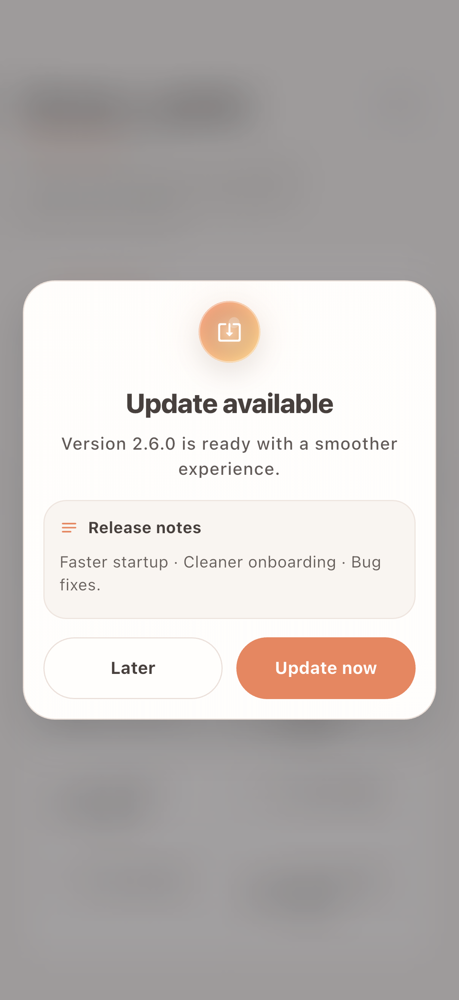
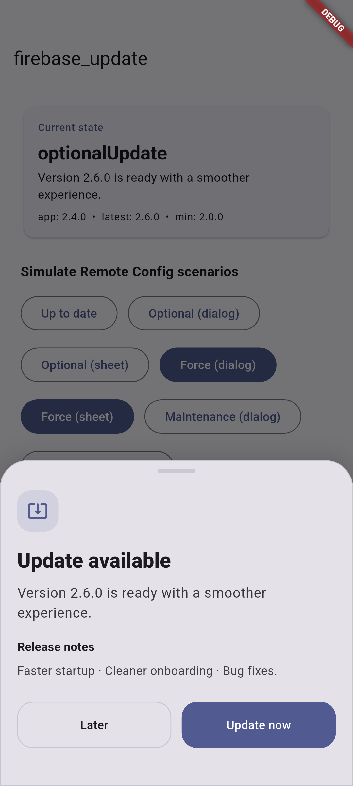
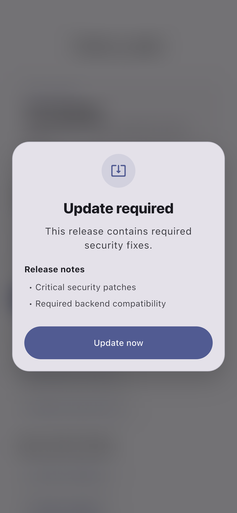
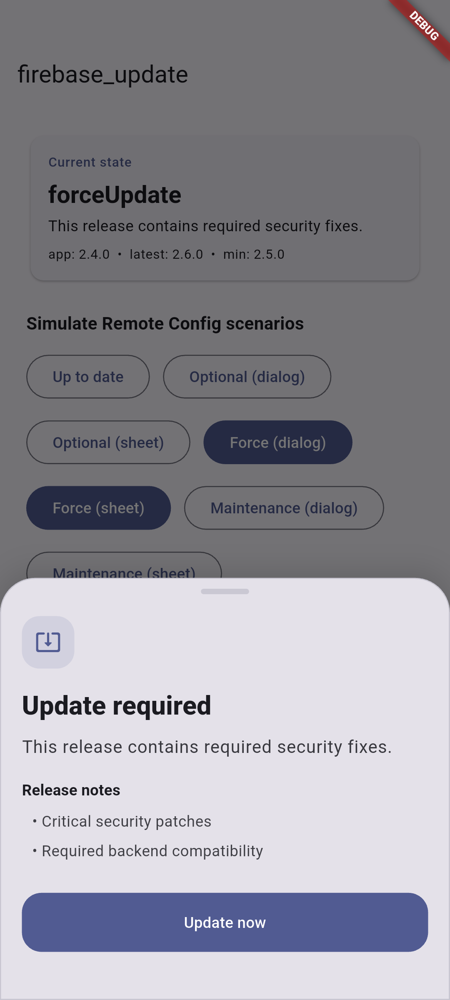
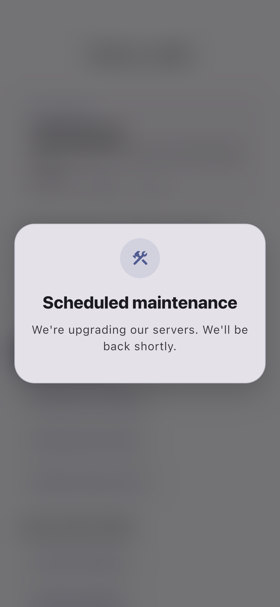
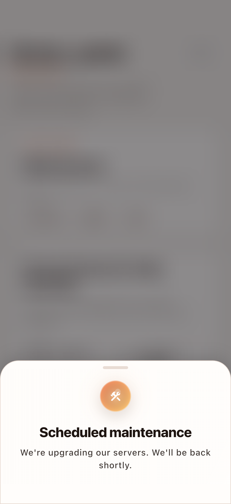
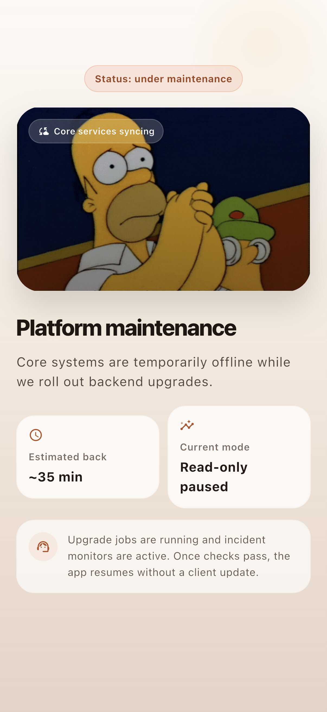
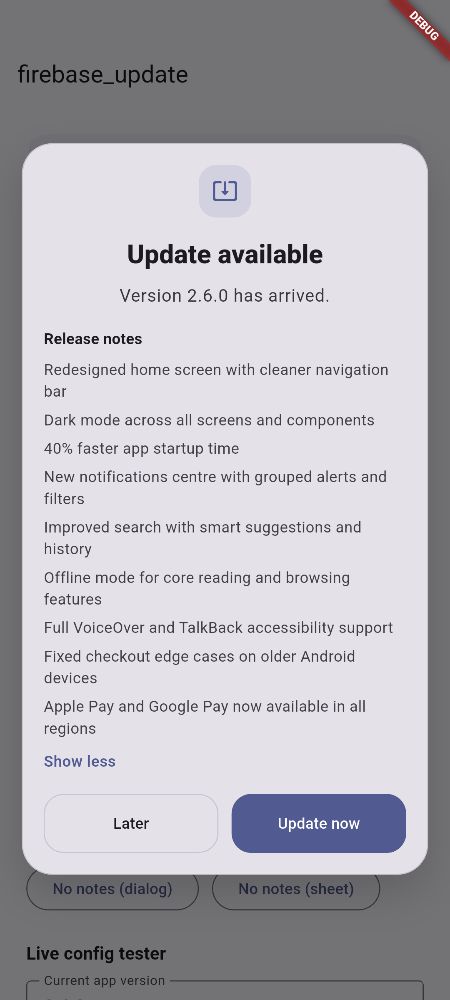

# firebase_update

Flutter force update, maintenance mode, patch notes, and custom update UI driven by Firebase Remote Config.

[](https://pub.dev/packages/firebase_update)
[](LICENSE)

`firebase_update` gives you one Remote Config payload and one package that can:

- block old builds with a force update
- show dismissible optional updates with snooze and skip-version behavior
- turn on maintenance mode instantly
- render patch notes in plain text or HTML
- react to real-time Remote Config changes without an app restart
- use package-managed UI or fully custom surfaces

## Screenshots

<p>
  
  
  
  
</p>

<p>
  
  
  
  
</p>

## Why this package

Most update-gate packages handle only one narrow case. Production apps usually need all of these:

- real-time response during incidents
- optional updates that users can defer safely
- hard blocking for incompatible builds
- maintenance mode that wins over every other state
- an escape hatch for fully custom UI when branding or layout demands it

`firebase_update` is built around those transitions instead of treating them as separate packages or ad hoc dialogs.

## Features

- Real-time Remote Config listening
- Optional update dialog or bottom sheet
- Force update dialog or bottom sheet
- Maintenance mode dialog, sheet, or fully custom blocking surface
- Snooze with version-aware reset
- Persistent skip-version
- Plain text and HTML patch notes
- `FirebaseUpdateBuilder` for reactive inline UI
- `FirebaseUpdateCard` for drop-in in-app surfaces
- Presentation theming, typography, labels, and icon overrides
- `allowDebugBack` for debug-only escape on blocking overlays
- `onBeforePresent` hook for preloading GIFs, images, or any async dependencies before showing an overlay
- Shorebird patch surface support

## Installation

```sh
dart pub add firebase_update
```

This package expects Firebase to already be configured in your app.

## Quick start

Initialize after `Firebase.initializeApp()` and pass the same `navigatorKey` to `MaterialApp`.

```dart
import 'package:firebase_core/firebase_core.dart';
import 'package:firebase_update/firebase_update.dart';
import 'package:flutter/material.dart';

final rootNavigatorKey = GlobalKey<NavigatorState>();

Future<void> main() async {
  WidgetsFlutterBinding.ensureInitialized();
  await Firebase.initializeApp();

  await FirebaseUpdate.instance.initialize(
    navigatorKey: rootNavigatorKey,
    config: const FirebaseUpdateConfig(),
  );

  runApp(
    MaterialApp(
      navigatorKey: rootNavigatorKey,
      home: const Placeholder(),
    ),
  );
}
```

## Remote Config schema

Create a Remote Config parameter named `firebase_update_config` whose value is a JSON string.

```json
{
  "min_version": "2.5.0",
  "latest_version": "2.6.0",
  "optional_update_title": "Update available",
  "optional_update_message": "A smoother release is ready.",
  "force_update_message": "This release contains required security fixes.",
  "maintenance_title": "Scheduled maintenance",
  "maintenance_message": "",
  "patch_notes": "Faster startup\nCleaner onboarding\nBug fixes",
  "patch_notes_format": "text",
  "store_url_android": "https://play.google.com/store/apps/details?id=com.example.app",
  "store_url_ios": "https://apps.apple.com/app/id000000000"
}
```

### Supported fields

| Field | Purpose |
|---|---|
| `min_version` | Minimum supported version. If `current < min_version`, force update is shown. |
| `latest_version` | Latest available version. If `current < latest_version` and the minimum is satisfied, optional update is shown. |
| `maintenance_title` | Title for maintenance mode. |
| `maintenance_message` | Non-empty value activates maintenance mode. |
| `force_update_title` | Optional force-update title override. |
| `force_update_message` | Optional force-update body override. |
| `optional_update_title` | Optional optional-update title override. |
| `optional_update_message` | Optional optional-update body override. |
| `patch_notes` | Patch notes shown beside update prompts. |
| `patch_notes_format` | `text` or `html`. |
| `store_url_android`, `store_url_ios`, `store_url_macos`, `store_url_windows`, `store_url_linux`, `store_url_web` | Remote-configured store URLs that override local fallback URLs. |

### State priority

Only one state is active at a time:

1. maintenance
2. force update
3. optional update
4. up to date

## Payload examples

### Optional update

Use this when you want to encourage upgrades without blocking the app.

```json
{
  "min_version": "2.0.0",
  "latest_version": "2.6.0",
  "optional_update_title": "Update available",
  "optional_update_message": "Version 2.6.0 is ready with a smoother experience.",
  "patch_notes": "Faster startup · Cleaner onboarding · Bug fixes.",
  "patch_notes_format": "text"
}
```

<p>
  
  
</p>

### Force update

Use this when the installed app version is no longer safe or compatible.

```json
{
  "min_version": "2.5.0",
  "latest_version": "2.6.0",
  "force_update_message": "This release contains required security fixes.",
  "patch_notes": "<ul><li>Critical security patches</li><li>Required backend compatibility</li></ul>",
  "patch_notes_format": "html"
}
```

<p>
  
  
</p>

### Maintenance mode

Use this when you need to temporarily gate the app without shipping a new build.

```json
{
  "maintenance_title": "Scheduled maintenance",
  "maintenance_message": "We're upgrading our servers. We'll be back shortly."
}
```

<p>
  
  
</p>

### Custom full-screen maintenance

Use the same maintenance payload, but replace the package default surface with your own branded takeover.

```dart
FirebaseUpdateConfig(
  onBeforePresent: (context, state) async {
    await precacheImage(
      const NetworkImage('https://example.com/maintenance.gif'),
      context,
    );
  },
  maintenanceWidget: (context, data) => MyMaintenanceTakeover(data: data),
)
```


### Long patch notes

When patch notes run long, the default UI collapses the content and expands it in-place with `Read more` / `Show less`.

```json
{
  "min_version": "2.0.0",
  "latest_version": "2.6.0",
  "optional_update_title": "Update available",
  "optional_update_message": "Version 2.6.0 has arrived.",
  "patch_notes": "Redesigned home screen with cleaner navigation bar\nDark mode across all screens and components\n40% faster app startup time\nNew notifications centre with grouped alerts and filters\nImproved search with smart suggestions and history\nOffline mode for core reading and browsing features\nFull VoiceOver and TalkBack accessibility support\nFixed checkout edge cases on older Android devices\nApple Pay and Google Pay now available in all regions",
  "patch_notes_format": "text"
}
```


## How it works

### State resolution

Every time the payload changes, the package resolves exactly one state.

```text
maintenance_message non-empty?  -> maintenance
current < min_version?          -> forceUpdate
current < latest_version?       -> optionalUpdate
otherwise                       -> upToDate
```

Only one overlay is shown at a time. If the state changes while one is already visible, the existing overlay is dismissed first and the higher-priority one takes its place.

### Snooze and skip-version

- `Later` with no `snoozeDuration` dismisses the optional update for the current app session
- `snoozeDuration` persists the dismiss until the timer expires
- snooze is version-aware, so a newer `latest_version` clears the older snooze immediately
- `showSkipVersion: true` adds a persistent "Skip this version" action for optional updates

## Common configurations

### Optional update with snooze

```dart
FirebaseUpdateConfig(
  snoozeDuration: const Duration(hours: 24),
  showSkipVersion: true,
)
```

### Force update as a bottom sheet

```dart
FirebaseUpdateConfig(
  useBottomSheetForForceUpdate: true,
)
```

### Debug-only blocking escape

```dart
FirebaseUpdateConfig(
  allowDebugBack: true,
)
```

### Preload assets before a custom overlay appears

```dart
FirebaseUpdateConfig(
  onBeforePresent: (context, state) async {
    await precacheImage(
      const NetworkImage('https://example.com/maintenance.gif'),
      context,
    );
  },
  maintenanceWidget: (context, data) => const MyFullScreenMaintenance(),
)
```

## Custom UI

You can replace any package-managed surface independently.

```dart
FirebaseUpdateConfig(
  optionalUpdateWidget: (context, data) => MyOptionalUpdateSheet(data: data),
  forceUpdateWidget: (context, data) => MyForceUpdateGate(data: data),
  maintenanceWidget: (context, data) => MyMaintenanceTakeover(data: data),
)
```

Each builder receives `FirebaseUpdatePresentationData`, which already contains:

- resolved title and state
- primary and secondary labels
- wired callbacks like `onUpdateClick`, `onLaterClick`, and `onSkipClick`
- dismiss flags for package-managed containers

## Reactive widgets

Use `FirebaseUpdateBuilder` when you want to render update state inside your own screen.

```dart
FirebaseUpdateBuilder(
  builder: (context, state) {
    if (state.kind == FirebaseUpdateKind.optionalUpdate) {
      return Text('Update ${state.latestVersion} is available');
    }
    return const SizedBox.shrink();
  },
)
```

Or drop in `FirebaseUpdateCard` for a built-in inline surface.

## API highlights

### `FirebaseUpdate.instance`

- `initialize(...)`
- `checkNow()`
- `applyPayload(...)`
- `stream`
- `currentState`
- `snoozeOptionalUpdate(...)`
- `dismissOptionalUpdateForSession()`
- `skipVersion(...)`
- `clearSnooze()`
- `clearSkippedVersion()`

### `FirebaseUpdateConfig`

Key options include:

- `listenToRealtimeUpdates`
- `enableDefaultPresentation`
- `useBottomSheetForOptionalUpdate`
- `useBottomSheetForForceUpdate`
- `useBottomSheetForMaintenance`
- `presentation`
- `optionalUpdateWidget`
- `forceUpdateWidget`
- `maintenanceWidget`
- `allowDebugBack`
- `onBeforePresent`
- `showSkipVersion`
- `snoozeDuration`
- `fallbackStoreUrls`
- `preferencesStore`

## Example app

The repo includes a complete example app under [`example/`](example) that demonstrates:

- package-managed dialogs and sheets
- long patch-note layouts
- live JSON payload testing
- a custom full-screen maintenance takeover with preloaded network media

## Testing and screenshots

Run the package tests:

```sh
flutter test
```

Run the example integration tests:

```sh
cd example
flutter test integration_test/update_flow_test.dart -d <device-id>
```

Regenerate the README screenshots:

```sh
./scripts/take_screenshots.sh -d <device-id>
```

## Links

- [Package page on pub.dev](https://pub.dev/packages/firebase_update)
- [Repository](https://github.com/qoder-official/firebase_update)
- [Issue tracker](https://github.com/qoder-official/firebase_update/issues)
